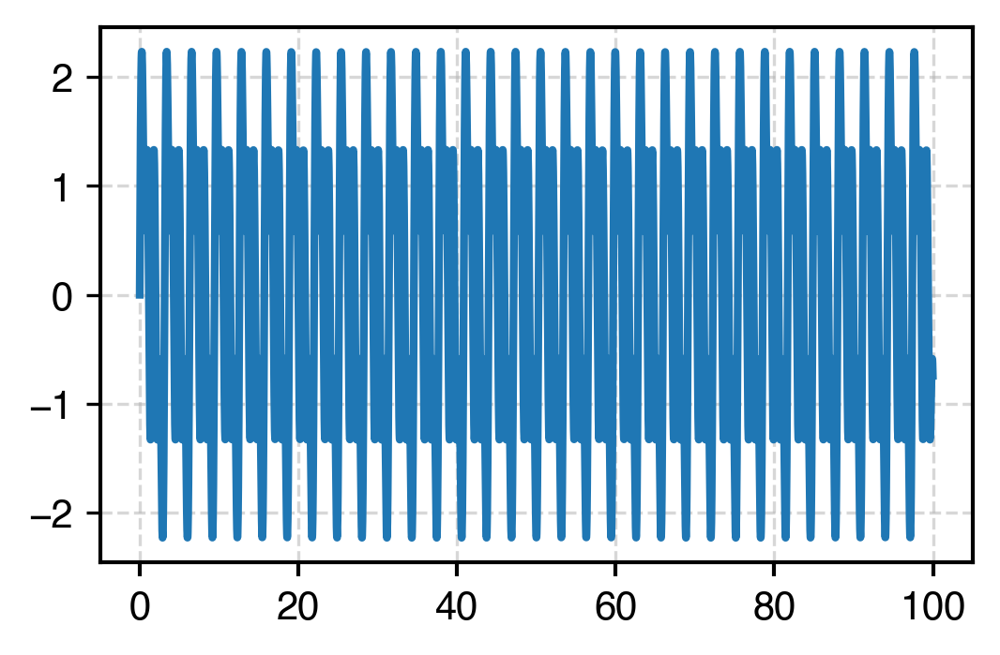

Here is a small Python implementation of the Fourier transform via Pade approximants found in this paper

>Bruner, Adam, Daniel LaMaster, and Kenneth Lopata. "Accelerated broadband spectra using transition dipole decomposition and Padé approximants." Journal of chemical theory and computation 12.8 (2016): 3741-3750.

## Dependencies
Should work with either `python2.7` or `python3`.

You'll need `numpy`, and ideally `scipy >= 0.17`

## Example

Usage is very simple. Here is an example:

First, let's make a time series 

```
import numpy as np
from pade import pade

t = np.arange(0.0, 20.0, 0.01)
signal = np.sin(2*t) + np.sin(4*t) + np.sin(8*t)
```

Which looks like this



Then we do the Pade

```
fw, frequency = pade(t,signal)
```

which, when we plot the imaginary component, looks like this


Which is what we expect, since our sinusoidal signal had frequencies at 2, 4 and 8.

You can look at the arguments in `pade.py` for more options, most relating to what frequencies you ultimately want to evaluate the transformed signal over. (The Pade-approximant method actually yields a rational function, so it's up to the user to choose the domain.)


